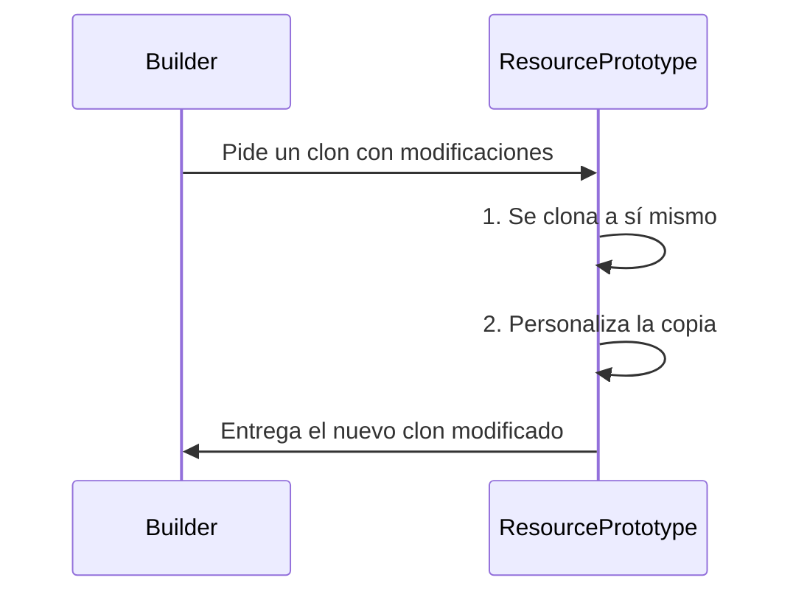

# Actividad14_CC3S2

## Fase 1: Exploración y análisis

### 1. Singleton

**Explica cómo `SingletonMeta` garantiza una sola instancia y el rol del `lock`.**

La clase `SingletonMeta` viene a ser como un vigilante en la creación de objetos. En el cóigo vemos que tiene una lista `_instances` donde guarda cada clase que ya ha creado un objeto.

Por ejemplo, la primera vez que se crea un objeto de una clase (por ejemplo de la clase `ConfigSingleton`), primero se verifica en la lista si es que hay otro objeto de la misma clase. Si no hay, entonces crea el objeto y lo guarda en la lista.

Entonces, en otro momento, cuando se quiera crear otro objeto de la misma clase, simplemente detectará en la lista que ya existe un objeto de la misma clase y evitará la creación del nuevo objeto, devolviendo el primer objeto creado.

### 2. Factory

**Detalla cómo la fábrica encapsula la creación de `null_resource` y el propósito de sus `triggers`.**

La clase `NullResourceFactory` funciona como un repartidor de recursos terraform. O sea, no se necesita cómo es que se arma el recurso, simplemente lo pedimos y lo recibimos.

En lugar de que nosotros mismos contruyamos el diccionario JSON que terraform necesita, solamente bastaría con llamar a esta clase, que se encargará de unir la estructura.

Ahora, los trigger le indican a Terraform en que momento debe crearse un recurso. En el código, la clase usa dos triggers: `factory_uuid` (que asegura que terraform diferencie los recursos) y `timestamp` (anota la fecha y hora de creación, asegurando que cada recurso que se cree sea totalmente único).

### 3. Prototype

**Dibuja un diagrama UML del proceso de clonación profunda y explica cómo el mutator permite personalizar cada instancia.**

El `mutator` es una función que es usado por el método `clone`, esto nos permite modificar la copia después de que esta haya sido creada.

Según el código, `mutator` nos permite, entre otras cosas, modificar el nombre de los recursos clonados o añadirle un índice, volviendo única a cada copia. Todo esto sin afectar el recurso original.

### 4. Composite

**Describe cómo `CompositeModule` agrupa múltiples bloques en un solo JSON válido para Terraform.**

La clase `CompositeModule` nos permite "almacenar" diversos recursos terraform como diccionarios, volviéndose al final un recurso lógico.

Primero se crearía una instancia de esta clase, que contenga una lista `_children`. Luego, cada vez que se cree un recurso, lo metemos a esta lista usando la función `add`. Cuando hayamos terminado, gracias a la función `export`, obtenemos un diccionario con la clave resource, combinando todos los recursos y poniéndose como valor de la clave resource.

Como resultado obtenemos un único JSON que contiene toda la estructura que necesita terraform.

### 5. Builder

**Explica cómo `InfrastructureBuilder` orquesta Factory -> Prototype -> Composite y genera el archivo JSON final.**

La clase `InfrastructureBuilder` indica a cada patrón que es lo que tiene que hacer y en qué momento, siguiendo una serie de pasos.

Primero, se usa el patrón Factory para crear un recurso base. Luego, usamos este recurso con el patrón Prototype para crear copias de este (en cada clonación usa la función `mutator` para personalizar el clon, por ejemplo para asignarle un índice único). Luego, cada recurso generado se añade a un `CompositeModule` (usando el patrón Composite), acumulando todos los recursos.

Por último, se usa la función `export` para exportar el archivo JSON formado en un archivo que hayamos especificado. Con esto vemos como este patrón realiza la coordinación entre los otros patrones.